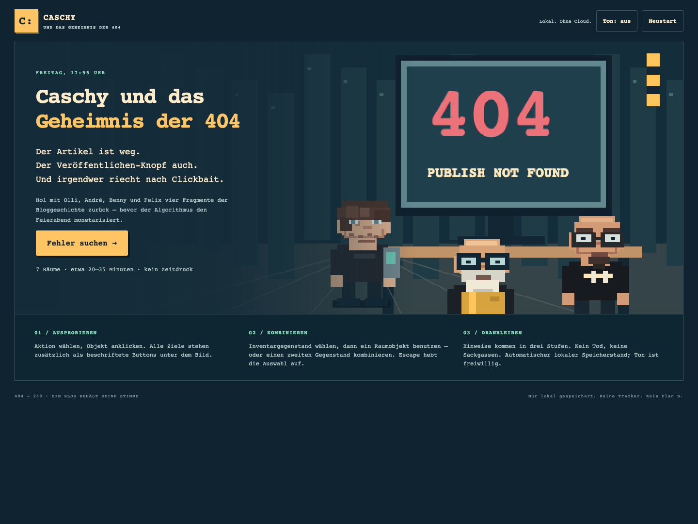
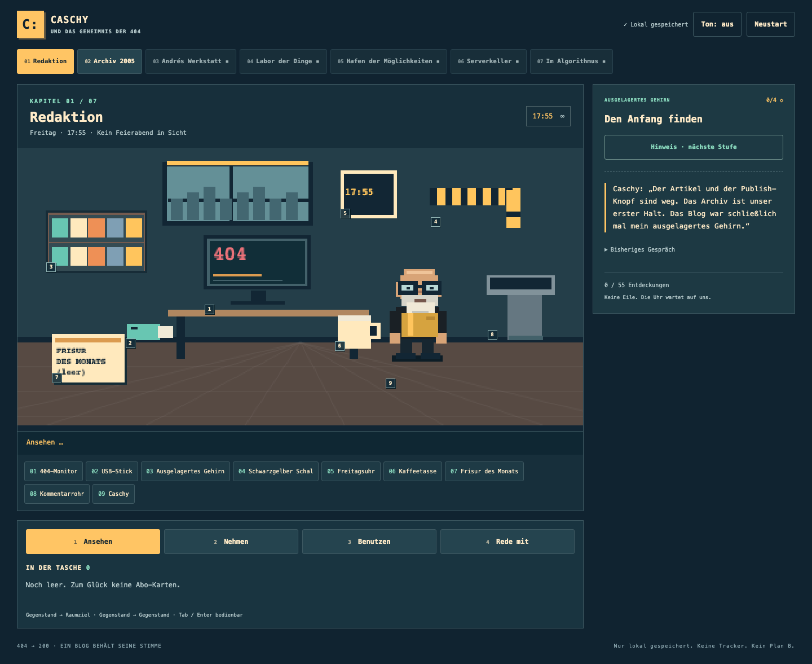
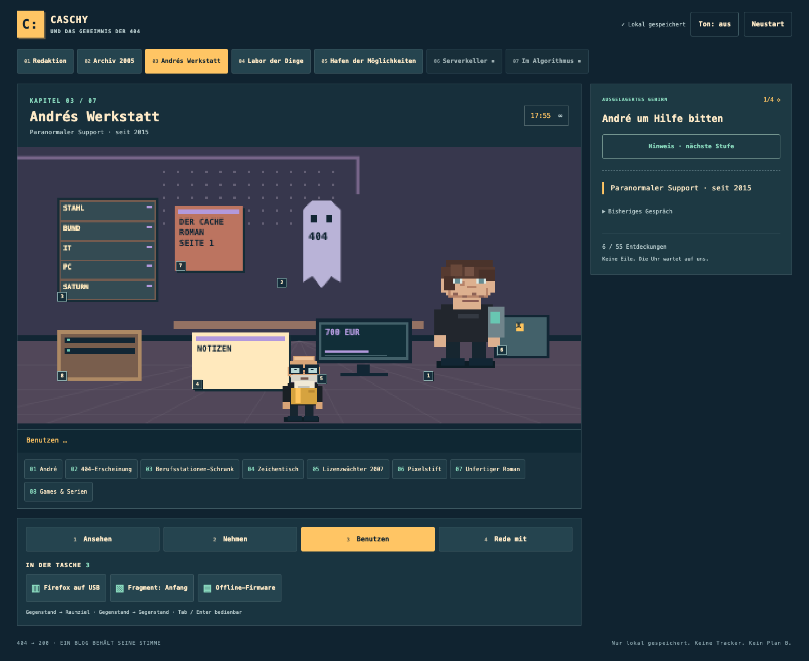
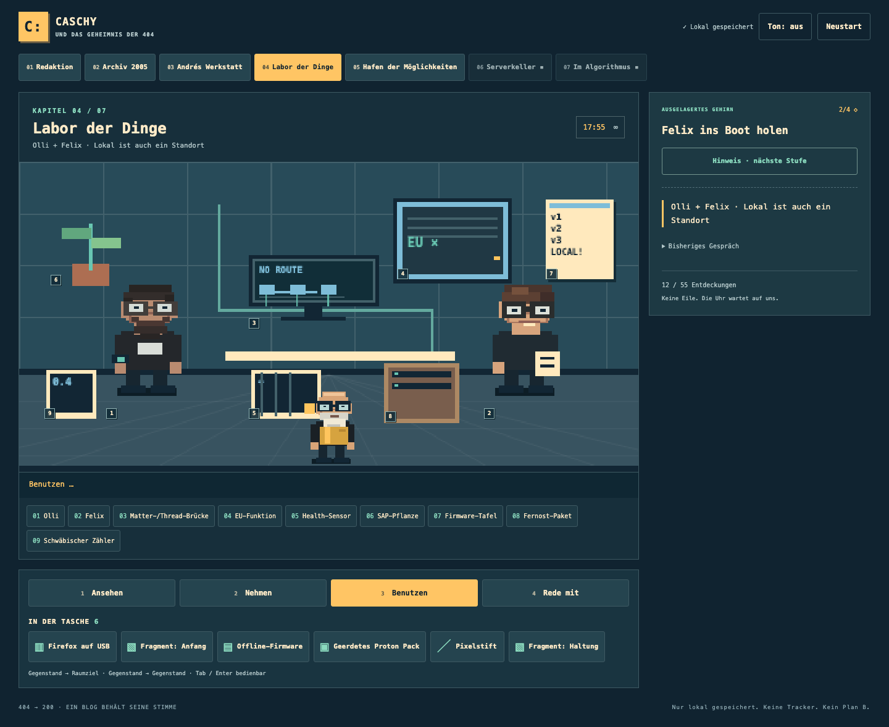
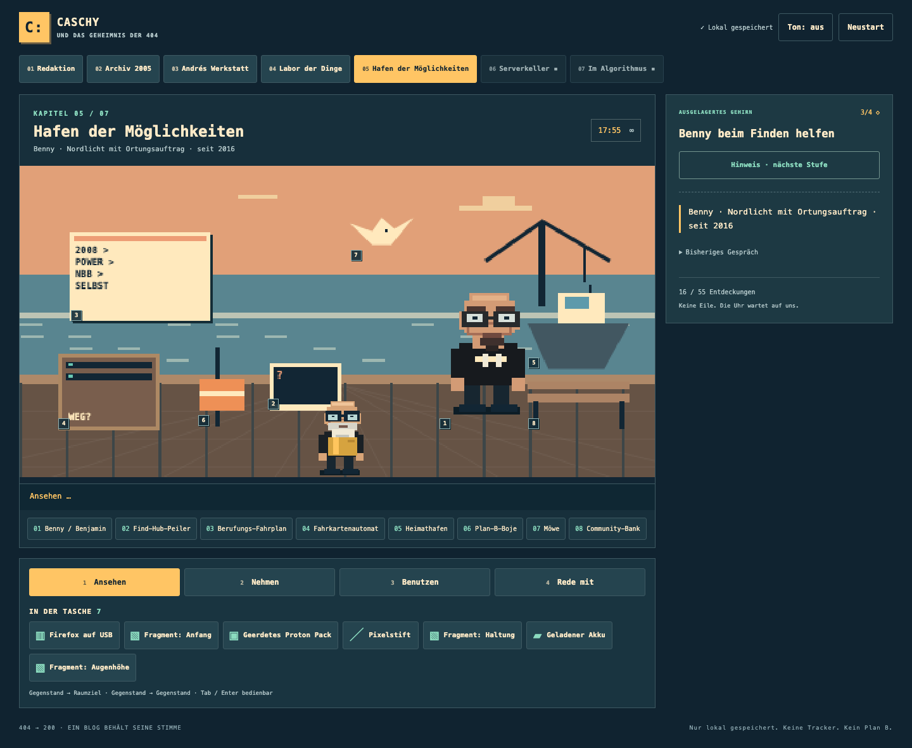

<p align="center">
  
</p>

<h1 align="center">Caschy und das Geheimnis der 404</h1>

<p align="center">
  Ein deutsches Pixel-Point-and-Click-Adventure über 20 Jahre Caschys Blog.
</p>

<p align="center">
  <a href="https://olli0103.github.io/caschy-adventure/"><strong>Im Browser spielen</strong></a>
  ·
  <a href="GAME-GUIDE.md">Lösung und Easter Eggs</a>
  ·
  <a href="SOURCES.md">Quellen</a>
</p>

Freitag, 17:55 Uhr. Der wichtigste Artikel und der Veröffentlichen-Knopf sind verschwunden. Der Algorithmus will aus dem unabhängigen Blog eine Clickbait-Maschine machen. Caschy reist durch die Geschichte des Blogs und braucht André, Olli, Felix und Benny, um den Publish-Schlüssel wieder zusammenzusetzen.

Das Spiel läuft vollständig im Browser. Es gibt kein Backend, keine Anmeldung und keine Downloads während des Spiels.

## Was drinsteckt

- 7 handgezeichnete Pixelräume
- 5 individuelle Figuren mit großformatigen Dialogporträts
- 9 Rätselstationen mit mehreren Lösungswegen
- 55 anklickbare Objekte und Easter Eggs
- etwa 20 bis 35 Minuten Spielzeit beim ersten Durchlauf
- automatischer Speicherstand im Browser
- Bedienung mit Maus, Touch oder Tastatur
- ein gutes Ende und ein reparierbarer Clickbait-Unfall

<p align="center">
  
  
</p>
<p align="center">
  
  
</p>

## Spielen

Die aktuelle Version läuft auf GitHub Pages:

### [Browsergame starten](https://olli0103.github.io/caschy-adventure/)

Der Speicherstand liegt ausschließlich in `localStorage` unter `caschy-adventure-404-v1`. Löschen der Browserdaten oder ein Wechsel der Domain entfernt deshalb den bisherigen Fortschritt.

## Bedienung

Wähle eine Aktion und danach ein Ziel im Raum:

- `1` Ansehen
- `2` Nehmen
- `3` Benutzen
- `4` Rede mit

Gegenstände lassen sich im Inventar auswählen und auf Raumziele oder andere Gegenstände anwenden. Beschriftete Objektlisten vermeiden Pixel-Hunting. Das Notizbuch zeigt das aktuelle Ziel und bis zu drei Hinweise.

Alle Schaltflächen funktionieren auch mit `Tab`, `Shift+Tab`, `Enter` und Leertaste. Das Layout passt sich an schmale Touchscreens an und respektiert Reduced Motion.

## Lokal starten

Node.js 20 oder neuer genügt. Das Spiel hat keine Laufzeitabhängigkeiten.

```sh
git clone https://github.com/Olli0103/caschy-adventure.git
cd caschy-adventure
npm start
```

Danach `http://127.0.0.1:8080` öffnen.

Ein beliebiger statischer HTTP-Server funktioniert ebenfalls. Der direkte Start über `file://` wird wegen der JavaScript-Module nicht unterstützt.

## Tests

```sh
npm install
npm run check
npm test
npx playwright install chromium
npm run test:browser
```

Der aktuelle Stand besteht 15 Logiktests und 74 Browserprüfungen. Die Browserprüfung spielt einen vollständigen Desktop-Weg und einen unabhängigen Touch-Weg durch. Sie prüft außerdem Save und Restore, Tastatursteuerung, Hinweise, beide Enden und alle 55 Entdeckungen.

Die vollständigen Ergebnisse stehen in [VERIFICATION.md](VERIFICATION.md). Screenshots und der maschinenlesbare Bericht liegen unter [`test-results/`](test-results/).

## Technik

Das Spiel besteht aus statischem HTML, CSS und JavaScript:

```text
index.html            Oberfläche, Intro, Finale und Neustartdialog
style.css             responsives Layout, Fokus und Touch
js/content.js         Räume, Figuren, Objekte und Texte
js/engine.js          Zustand, Inventar, Dialoge und Rätsel
js/art.js             zustandsabhängige Canvas-Pixelgrafik
js/app.js             Browseradapter, Speicherung und SFX
server.mjs            kleiner lokaler Entwicklungsserver
```

`engine.js` verwaltet den vollständigen Spielzustand. Die Oberfläche sendet nur Aktionen und setzt keine Lösungsflags. Alle Grafiken entstehen direkt im Canvas. Das Repository enthält keine fremden Fotos, Sprites, Sounds oder Schriftdateien.

## Quellen und Einordnung

Dies ist ein eigenständiges, fiktives Fan-Adventure. Es ist weder eine Biografie noch ein offizielles Produkt von Caschys Blog. Historische Anker stammen vor allem aus Caschys Rückblicken zum zehn- und zwanzigjährigen Blogjubiläum. Handlung, Rätsel und Dialoge wurden für das Spiel geschrieben.

[SOURCES.md](SOURCES.md) trennt belegte Bloggeschichte, Vorgaben und Fiktion. Der komplette Lösungsweg samt Liste aller 55 Hotspots steht in [GAME-GUIDE.md](GAME-GUIDE.md).
